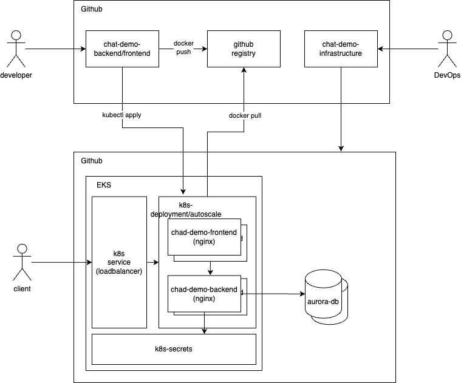

# Intro

I’ve developed a fully working POC for a scalable platform. Working instance is here - [link](http://a48ccd0efc283442290669d6a5325a17-779552031.us-east-1.elb.amazonaws.com/)
This document outlines the design and implementation of a microservices architecture platform using AWS EKS to host a chat application. The solution covers infrastructure, orchestration, deployment, release lifecycle, testing, monitoring, and security.

## 1. Infrastructure Platform

**Platform Choice:** AWS (Amazon Web Services)

**Rationale:**
- AWS provides a comprehensive suite of services that support microservices architectures.
- EKS (Elastic Kubernetes Service) offers managed Kubernetes, simplifying cluster management.
- Integrated services for storage (EBS, S3), databases (RDS, Aurora), networking (VPC, Route 53), and security (IAM, KMS).
- Global presence and reliability with multiple availability zones.

**Key Services:**
- **EKS (Elastic Kubernetes Service):** Managed Kubernetes service for container orchestration.
- **AuroraDB:** A fully managed, highly available, and auto-scaling relational database service.

## 2. Orchestration Technology

**Orchestration Technology:** Kubernetes

**Components:**
- **EKS (Elastic Kubernetes Service):** Managed Kubernetes service for container orchestration.
- **Helm:** Kubernetes package manager for managing complex deployments.
- **Kustomize:** Native Kubernetes configuration management tool.
- **Cluster Autoscaler:** Automatically adjusts the size of the Kubernetes cluster based on the needs of the application.
- **AuroraDB:** Managed PostgreSQL-compatible relational database with built-in high availability and auto-scaling.

**Rationale:**
- Kubernetes provides robust orchestration capabilities, including scaling, self-healing, and rolling updates.
- EKS simplifies Kubernetes management, providing a secure and scalable environment.
- AuroraDB offers automatic scaling, backup, and recovery features, reducing the operational burden.

## 3. Infrastructure Deployment Automation

**Tools:** Terraform

**Rationale:**
- Terraform allows for infrastructure as code (IaC), enabling version-controlled, repeatable deployments.
- Strong support for AWS services.

**Configuration Highlights:**
- Set up the AWS provider.
- Create a VPC, subnets, and an EKS cluster.
- Configure node groups for the EKS cluster.
- Set up an AuroraDB cluster with auto-scaling configuration.

## 4. Microservices Deployment Automation

**Tools:** Helm, Kubernetes, Github actions

**Rationale:**
- Helm simplifies deployment management through templated Kubernetes manifests.
- Kubernetes provides native support for deploying and managing containerized applications.

**Configuration Highlights:**
- Define Helm chart values for backend and frontend services.
- Include configuration for connecting to the AuroraDB instance.
- Use Helm commands to install and upgrade the application.
  
## 5. Release Lifecycle

**Phases:**
1. **Development:** Code changes are committed to the feature branch.
2. **Build:** CI/CD pipeline builds Docker images and runs unit tests.
3. **Testing:** Deploy to a staging environment and run integration tests.
4. **Approval:** Manual approval for production deployment.
5. **Release:** Deploy to the production environment using Helm.

**CI/CD Pipeline:**
- Use GitHub Actions or another CI/CD tool to automate the build, test, and deployment process.
- Steps include checking out code, building Docker images, pushing images to a registry, and deploying to EKS using Helm.

## 6. Infrastructure Testing Approach

**Types of Tests:**
- **Unit Tests:** Test individual components of Terraform scripts using Terratest.
- **Integration Tests:** Validate the interaction between components after deployment.
- **End-to-End Tests:** Verify the entire application flow in a staging environment.

**Testing Strategy:**
- Implement Terratest for infrastructure testing.
- Deploy infrastructure to a test environment and run integration tests.
- Perform end-to-end tests in a staging environment to ensure system integrity.

## 7. Monitoring Approach

**Tools:**
- **Prometheus & Grafana:** Monitoring and alerting.
- **AWS CloudWatch:** Logs and metrics collection.
- **ELK Stack (Elasticsearch, Logstash, Kibana):** Centralized logging.

**Rationale:**
- Prometheus provides powerful monitoring and alerting capabilities.
- Grafana offers flexible, customizable dashboards.
- CloudWatch and ELK Stack ensure comprehensive logging and metrics collection.

**Monitoring Strategy:**
- Configure Prometheus to scrape metrics from Kubernetes and application endpoints.
- Use Grafana to visualize metrics and set up alerting rules.
- Centralize logs using AWS CloudWatch and the ELK Stack to monitor application and infrastructure logs.

## 8. Security

**Tools and Practices:**
- **IAM (Identity and Access Management):** Fine-grained access control for AWS resources.
- **KMS (Key Management Service):** Managed service to create and control the encryption keys.
- **Secrets Manager:** Securely store and manage sensitive information such as database credentials.
- **Security Groups and Network ACLs:** Control inbound and outbound traffic to AWS resources.
- **Pod Security Policies:** Enforce security standards for pods running in the Kubernetes cluster.
- **AWS WAF (Web Application Firewall):** Protect web applications from common web exploits.

**Security Strategy:**
- **IAM Policies:** Implement the principle of least privilege by defining IAM policies that grant the minimum required permissions.
- **Encryption:** Encrypt data at rest using AWS KMS and in transit using TLS.
- **Secrets Management:** Use AWS Secrets Manager to store and retrieve secrets securely.
- **Network Security:** Use Security Groups and Network ACLs to control traffic to and from EKS nodes and other AWS resources.
- **Pod Security:** Define and enforce pod security policies to limit container privileges and ensure compliance with security standards.
- **Web Application Security:** Deploy AWS WAF to protect the frontend service from common web vulnerabilities such as SQL injection and cross-site scripting (XSS).

**Additional Measures:**
- **Regular Audits:** Conduct regular security audits and vulnerability assessments.
- **Logging and Monitoring:** Enable detailed logging and monitoring to detect and respond to security incidents promptly.
- **Incident Response:** Develop and maintain an incident response plan to handle potential security breaches effectively.

## Repository

The full implementation and detailed configurations are available in the following repositories:
- [instance](http://a48ccd0efc283442290669d6a5325a17-779552031.us-east-1.elb.amazonaws.com/)
- [chat-demo-infrastructure](https://github.com/akablockchain2/chat-demo-infrastructure)
- [chat-demo-backend](https://github.com/akablockchain2/chat-demo-backend)
- [chat-demo-frontend](https://github.com/akablockchain2/chat-demo-frontend)

